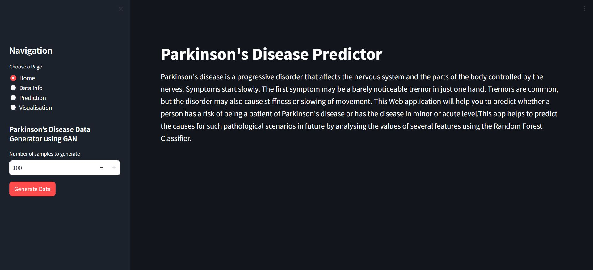

# Parkinson's Disease Predictor



## Introduction:

Parkinson’s disease is a complex neurodegenerative disorder that affects movement. Characterized by tremors, stiffness, and bradykinesia, it can significantly impact the quality of life. Early detection is crucial for managing symptoms and slowing progression. It's a progressive disorder that affects the nervous system and the parts of the body controlled by the nerves. Symptoms start slowly. The first symptom may be a barely noticeable tremor in just one hand. Tremors are common, but the disorder may also cause stiffness or slowing of movement.

## Solution:

This Web app will help you to predict whether a person has chances of parkinsons disease or is prone to get it in future by analysing the values of several features using the Decision Tree Classifier.

## Features

**Home Page**

- This includes the brief introduction about Parkinsons disease

**Data Information**

- This page includes all the information about the data where we can view the entire data , get the description of the data, get the column names and its type and you can view the dataset

**Prediction**

- In this page, you can select the different values of the features which will help you predict whether a person is having parkinsons disease or not.

**Visualisation**

- This page includes all the visualisation part which includes correlation heatmap, scatter plot, box plot, decision tree

### Layout

```
├───images
├───Tabs
|   └─── home.py
|   └─── data.py
|   └─── predict.py
|   └─── visualize.py
└─── app.py
└─── Parkinson.csv
└─── web_functions.py
└─── requirements.txt
└─── setup.sh
```

## Installation

To set up the application locally, follow these steps:

1. Clone the repository
2. Navigate to the project directory
3. Install requirements.txt
4. Run the app.py with streamlit

## References

- https://towardsdatascience.com/10-lessons-i-learned-training-generative-adversarial-networks-gans-for-a-year-c9071159628
- https://machinelearningmastery.com/what-are-generative-adversarial-networks-gans/
- https://link.springer.com/chapter/10.1007/978-3-642-34062-8_32
- https://www.youtube.com/watch?v=Gib_kiXgnvA
- https://github.com/MainakRepositor/Cardiac-Arrest-Predictor
- https://www.nia.nih.gov/health/parkinsons-disease/parkinsons-disease-causes-symptoms-and-treatments#:~:text=Parkinson's%20disease%20is%20a%20brain, have%20difficulty%20walking%20and%20talking.
